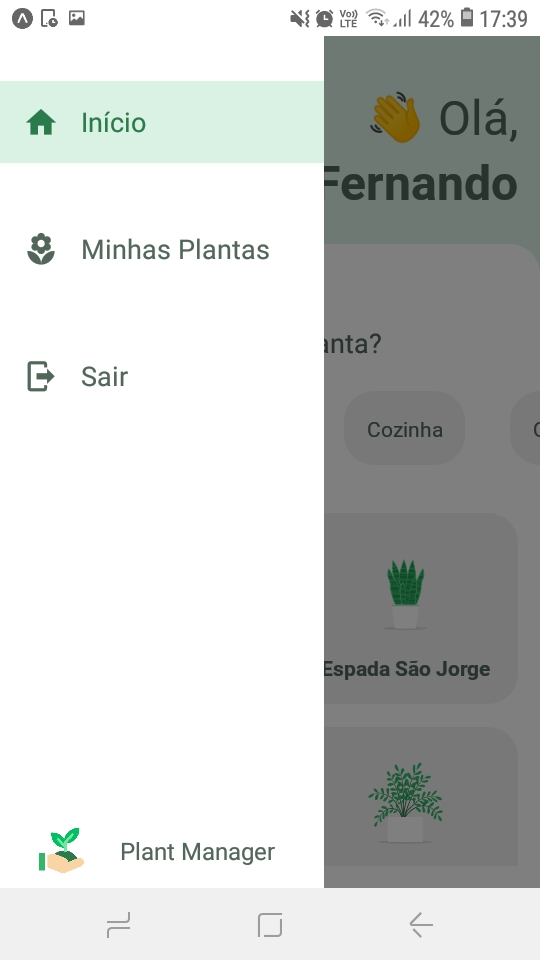
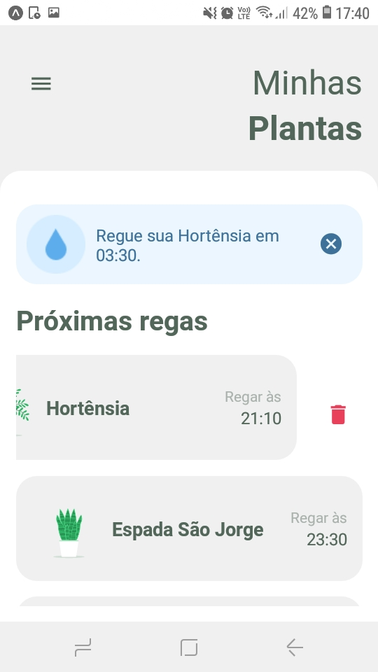

<h1 align="center">
   
</h1>

<p align="center">
  <a href="https://github.com/fernandogatto/" target="_blank">
    
  </a>

  
  
       

  
</p>

> Application from Plant Manager, to always remember to water your plants. Developed during **Next Level Week 5**, on April 19-25, 2021 and organized by [Rocketseat](https://rocketseat.com.br/).

## 🔗 Table of contents
- [Technologies](#technologies)
- [Installation](#installation)
- [Getting start](#start)
- [Project](#project)
- [Contribute](#contribute)
- [License](#license)

## 📌 Technologies <a name="technologies"/>

- [React Native](https://reactnative.dev/)
- [Expo](https://expo.io/)
- [React Native Paper](https://callstack.github.io/react-native-paper/)
- [React Native Skeleton Placeholder](https://github.com/chramos/react-native-skeleton-placeholder)
- [Styled Components](https://styled-components.com/)

## 📂 Installation <a name="installation"/>

First of all, it is important that you have installed [Yarn](https://yarnpkg.com/) and [Expo](https://expo.io/).

So, run this command in terminal to clone the project via HTTPS:

```bash
git clone https://github.com/fernandogatto/plantmanager-mobile.git
```

**Install dependencies**

```bash
yarn install
```

## 🚀 Getting start <a name="start"/>

First, you have to install Expo App on your smarthphone.

So, run the following command in terminal:

```bash
# Start the server
expo start
```

With Expo open on your smarthphone, scan the QR Code of Expo Server.

**Run API**

First, make sure to enter your IP address in following file:

```bash
./src/common/constants/IP_ADDRESS.js
```

So, run the following command in another terminal:

```bash
yarn json-server ./src/common/services/server.json --host YOUR_IP_ADDRESS --port 3333
```

## 💻 Project <a name="project"/>

You can view the project layout through the links below:

- [Layout](https://www.figma.com/file/IhQRtrOZdu3TrvkPYREzOy/PlantManager) 

Screens:







## 👍 Contribute <a name="contribute"/>

- Fork this repository.
- Create a branch with your resource: ```git checkout -b feature/my-feature```
- Submit changes: ```git commit -m "feat: My new feature"```
- Push your branch: ```git push origin feature/my-feature```

## 📕 License <a name="license"/>

Released in 2021. This project is under the [MIT License](https://choosealicense.com/licenses/mit/).

Build with 💜 by [Fernando Gatto](https://github.com/fernandogatto/).
